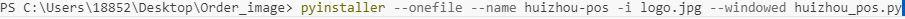
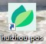
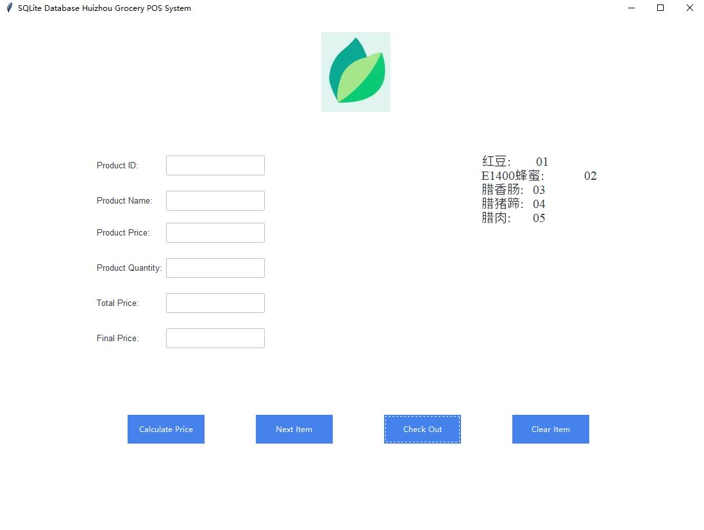
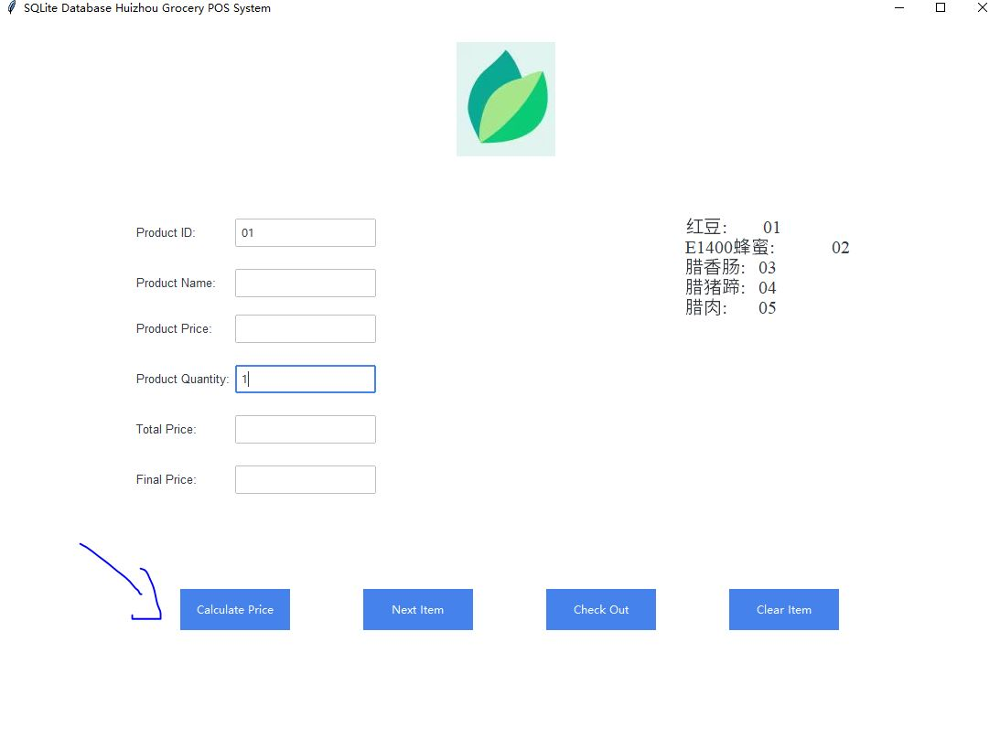
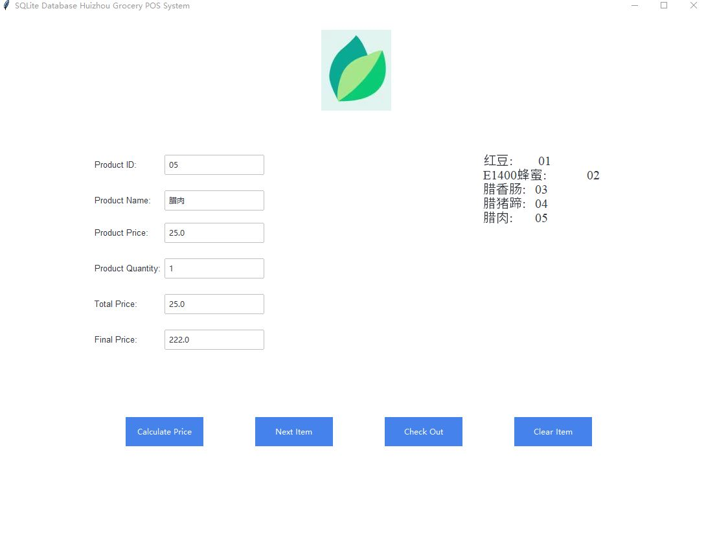
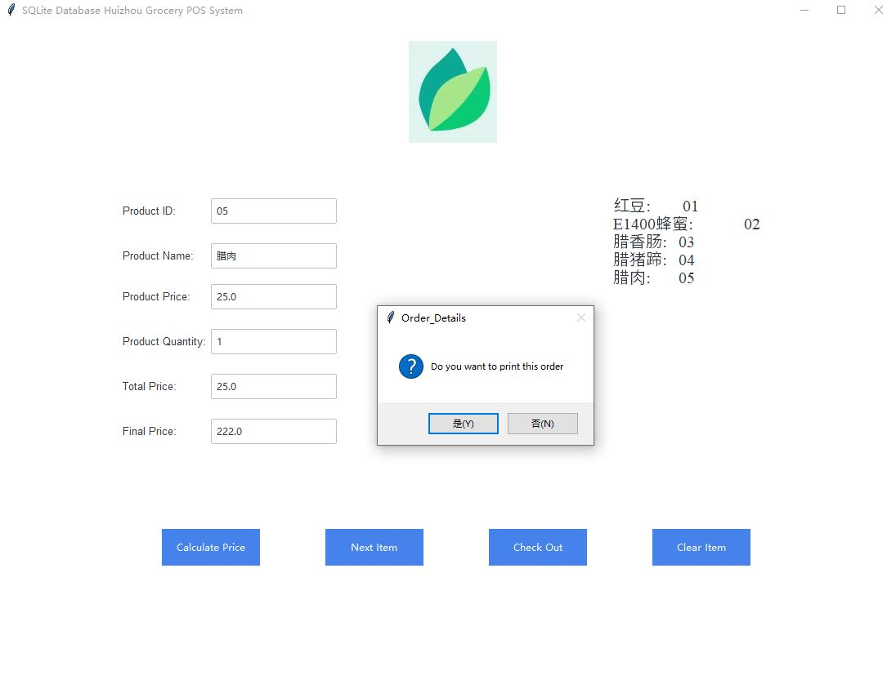
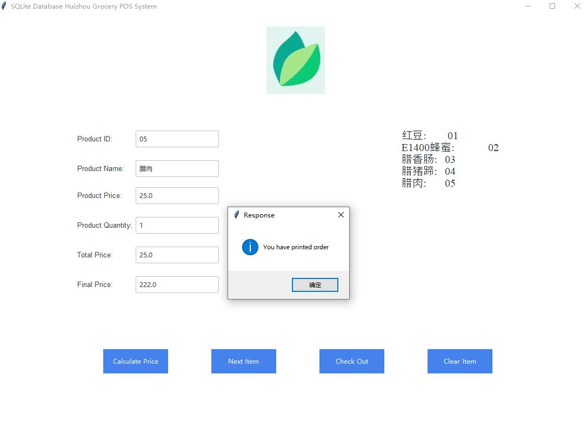
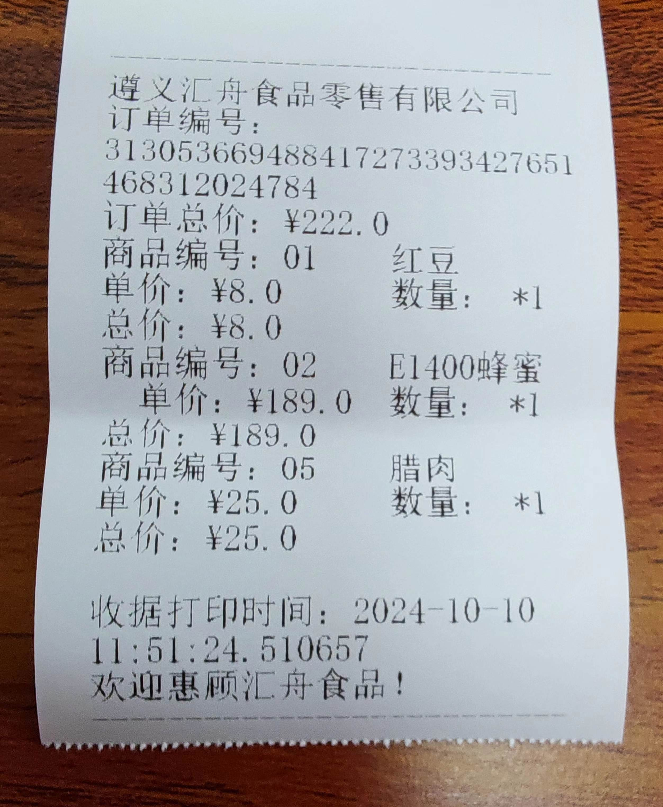
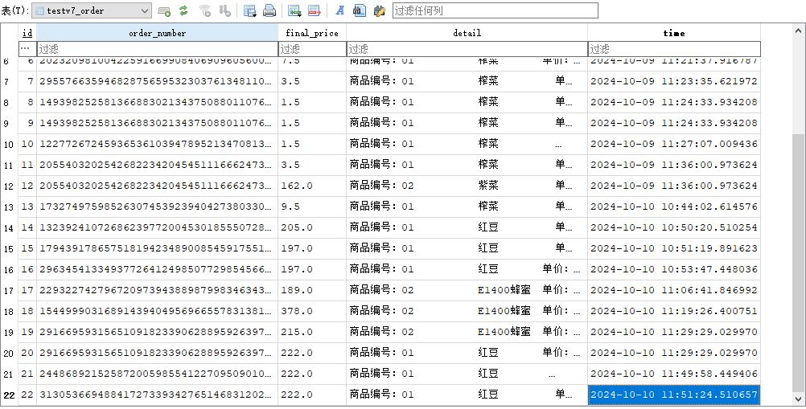

<div align="center">
  <h1 align = "center">Huizhou Grocery POS System (Beta) </h1>
</div>

[](/LICENSE)

This is POS (point of sale) system of Huizhou Grocery (beta) and it is our open-source project on GitHub. 

With this Python script and one SQLite database on your desktop, you could realize simple and lightweight POS system management. At the same time, you could print your grocery receipt with this Python script.

Firstly, you need to download Python code, and change your directory name in the script. Please do not forget about your path to the SQLite database.
Next thing is to set up your environment(Windows-oriented).

```shell
pip install ttkbootstrap
```
<br/>

Win32print is not a very popular library, which means you may get errors. You could run both commands to install it in your environment.
```shell
pip install win32printing
```
or
```shell
pip install pywin32
```

After you can run Python code on your terminal, you need to run this code below.
```shell
pyinstaller --onefile --name huizhou-pos -i logo.jpg --windowed huizhou_pos.py
```

<p align="center">
  
</p>

You will get an exe file in your working directory.

<p align="center">
  
</p>

You could open this desktop software program with easy UI to test it. We just attached some screenshots. You only need to input product ID and product quantity to calculate price.

<p align="center">
  
</p>

<p align="center">
  
</p>


<p align="center">
  
</p>


<p align="center">
  
</p>

<p align="center">
  
</p>

There is our receipt template, and you could change languages and formats.
<p align="center">
  
</p>

Once you have printed your receipt, you could check your Sqlite database.
<p align="center">
  
</p>

This Python script only has 300 lines of code, and this lightweight exe program only has 60 MB size. You may face many challenges when you start to set up a printer. You just need to buy one cheap printer and 58 mm paper. Your printer needs to have a Windows OS driver and a USB interface with your desktop (laptop). You need to let your printer become the default printer in your Windows environment. After that, you may find that this program runs smoothly.

We decide to choose the TXT format for our receipt, do not forget to change your default paper (font) size of the TXT format on your Windows environment. Or you may find that our program can not change this. We do not have this function.

Why beta? We are still developing some functions for our POS system. Like, we could build one MySQL database on our remote server (or cloud). Once we click check out, all the data will be sent there. We may design our own inventory management system for our grocery store to save many, many IT costs. There are many functions you could think about and develop. 
